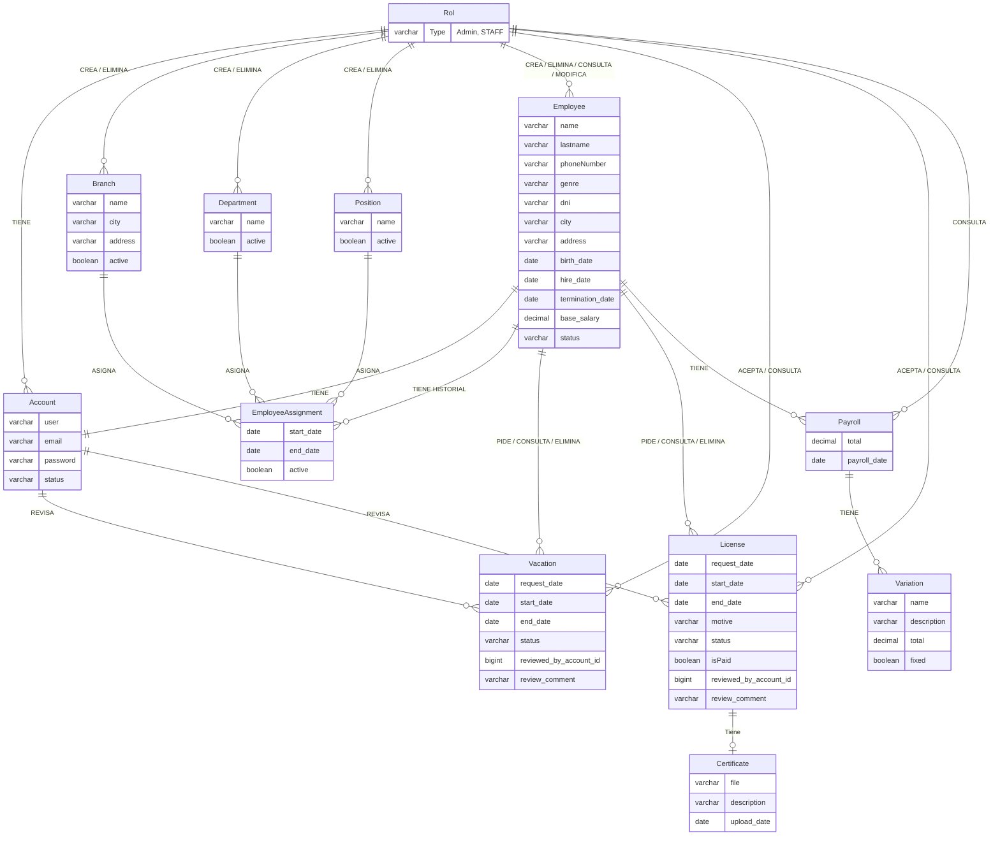

```mermaid

erDiagram
%% Entidades y Atributos
Account {
varchar user
varchar email
varchar password
varchar status
}

    Rol {
        varchar Type "Admin, STAFF"
    }

    Branch {
        varchar name
        varchar city
        varchar address
        boolean active
    }

    Variation {
        varchar name
        varchar description
        decimal total
        boolean fixed
    }

    Payroll {
        decimal total
        date payroll_date
    }

    Department {
        varchar name
        boolean active
    }

    Position {
        varchar name
        boolean active
    }

    Employee {
        varchar name
        varchar lastname
        varchar phoneNumber
        varchar genre
        varchar dni
        varchar city
        varchar address
        date birth_date
        date hire_date
        date termination_date
        decimal base_salary
        varchar status
    }

    EmployeeAssignment {
        date start_date
        date end_date
        boolean active
    }

    Vacation {
        date request_date
        date start_date
        date end_date
        varchar status
        bigint reviewed_by_account_id
        varchar review_comment
    }

    License {
        date request_date
        date start_date
        date end_date
        varchar motive
        varchar status
        boolean isPaid
        bigint reviewed_by_account_id
        varchar review_comment
    }

    Certificate {
        varchar file
        varchar description
        date upload_date
    }

    %% Relaciones de Rol (Admin, STAFF)
    Rol ||--o{ Account : "TIENE"
    Rol ||--o{ Branch : "CREA / ELIMINA"
    Rol ||--o{ Department : "CREA / ELIMINA"
    Rol ||--o{ Position : "CREA / ELIMINA"
    Rol ||--o{ Employee : "CREA / ELIMINA / CONSULTA / MODIFICA"
    Rol ||--o{ Vacation : "ACEPTA / CONSULTA"
    Rol ||--o{ License : "ACEPTA / CONSULTA"
    Rol ||--o{ Payroll : "CONSULTA"

    %% Relaciones de Employee
    Employee ||--|| Account : "TIENE"
    Employee ||--o{ EmployeeAssignment : "TIENE HISTORIAL"
    Branch ||--o{ EmployeeAssignment : "ASIGNA"
    Department ||--o{ EmployeeAssignment : "ASIGNA"
    Position ||--o{ EmployeeAssignment : "ASIGNA"
    Employee ||--o{ Vacation : "PIDE / CONSULTA / ELIMINA"
    Employee ||--o{ License : "PIDE / CONSULTA / ELIMINA"
    Employee ||--o{ Payroll : "TIENE"
    Account ||--o{ Vacation : "REVISA"
    Account ||--o{ License : "REVISA"

    %% Otras Relaciones
    License ||--o| Certificate : "Tiene"
    Payroll ||--o{ Variation : "TIENE"
```
