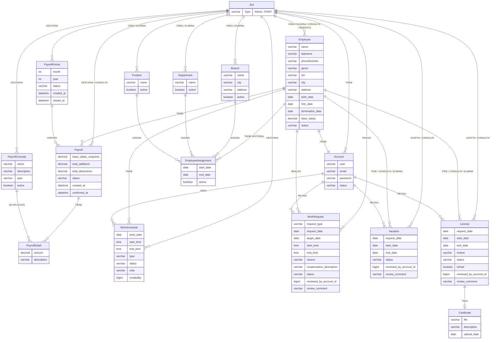

```mermaid

erDiagram
%% Entidades y Atributos
Account {
varchar user
varchar email
varchar password
varchar status
}

    Rol {
        varchar Type "Admin, STAFF"
    }

    Branch {
        varchar name
        varchar city
        varchar address
        boolean active
    }

    PayrollPeriod {
        int month
        int year
        varchar status
        datetime created_at
        datetime closed_at
    }

    Payroll {
        decimal base_salary_snapshot
        decimal total_additions
        decimal total_deductions
        varchar status
        datetime created_at
        datetime confirmed_at
    }

    PayrollConcept {
        varchar name
        varchar description
        varchar type
        boolean active
    }

    PayrollDetail {
        decimal amount
        varchar description
    }

    Department {
        varchar name
        boolean active
    }

    Position {
        varchar name
        boolean active
    }

    Employee {
        varchar name
        varchar lastname
        varchar phoneNumber
        varchar genre
        varchar dni
        varchar city
        varchar address
        date birth_date
        date hire_date
        date termination_date
        decimal base_salary
        varchar status
    }

    EmployeeAssignment {
        date start_date
        date end_date
        boolean active
    }

    WorkSchedule {
        date work_date
        time start_time
        time end_time
        varchar type
        varchar status
        varchar note
        bigint createdby
    }

    WorkRequest {
        varchar request_type
        date request_date
        date target_date
        time start_time
        time end_time
        varchar reason
        varchar conpensation_description
        varchar status
        bigint reviewed_by_account_id
        varchar review_comment
    }

    Vacation {
        date request_date
        date start_date
        date end_date
        varchar status
        bigint reviewed_by_account_id
        varchar review_comment
    }

    License {
        date request_date
        date start_date
        date end_date
        varchar motive
        varchar status
        boolean isPaid
        bigint reviewed_by_account_id
        varchar review_comment
    }

    Certificate {
        varchar file
        varchar description
        date upload_date
    }

    %% Relaciones de Rol (Admin, STAFF)
    Rol ||--o{ Account : "TIENE"
    Rol ||--o{ Branch : "CREA / ELIMINA"
    Rol ||--o{ Department : "CREA / ELIMINA"
    Rol ||--o{ Position : "CREA / ELIMINA"
    Rol ||--o{ Employee : "CREA / ELIMINA / CONSULTA / MODIFICA"
    Rol ||--o{ WorkSchedule : "GESTIONA"
    Rol ||--o{ WorkRequest : "REVISA"
    Rol ||--o{ Vacation : "ACEPTA / CONSULTA"
    Rol ||--o{ License : "ACEPTA / CONSULTA"
    Rol ||--o{ PayrollPeriod : "GESTIONA"
    Rol ||--o{ PayrollConcept : "GESTIONA"
    Rol ||--o{ Payroll : "GESTIONA / CONSULTA"

    %% Relaciones de Employee
    Employee ||--|| Account : "TIENE"
    Employee ||--o{ EmployeeAssignment : "TIENE HISTORIAL"
    Branch ||--o{ EmployeeAssignment : "ASIGNA"
    Department ||--o{ EmployeeAssignment : "ASIGNA"
    Position ||--o{ EmployeeAssignment : "ASIGNA"
    Employee ||--o{ WorkSchedule : "TIENE"
    Employee ||--o{ WorkRequest : "REALIZA"
    Employee ||--o{ Vacation : "PIDE / CONSULTA / ELIMINA"
    Employee ||--o{ License : "PIDE / CONSULTA / ELIMINA"
    Employee ||--o{ Payroll : "TIENE"
    Account ||--o{ WorkSchedule : "CREA"
    Account ||--o{ WorkRequest : "REVISA"
    Account ||--o{ Vacation : "REVISA"
    Account ||--o{ License : "REVISA"

    %% Otras Relaciones
    License ||--o| Certificate : "Tiene"
    PayrollPeriod ||--o{ Payroll : "AGRUPA"
    Payroll ||--o{ PayrollDetail : "TIENE"
    PayrollConcept ||--o{ PayrollDetail : "SE APLICA EN"
```
